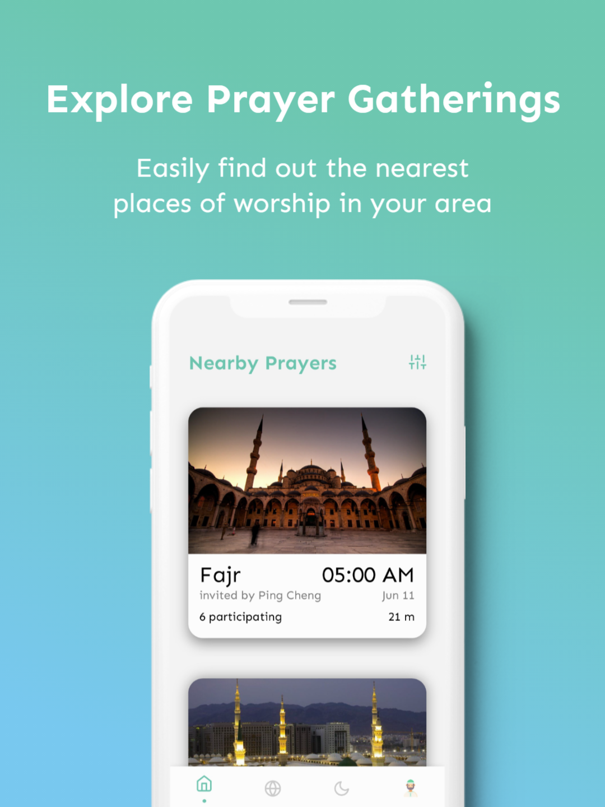
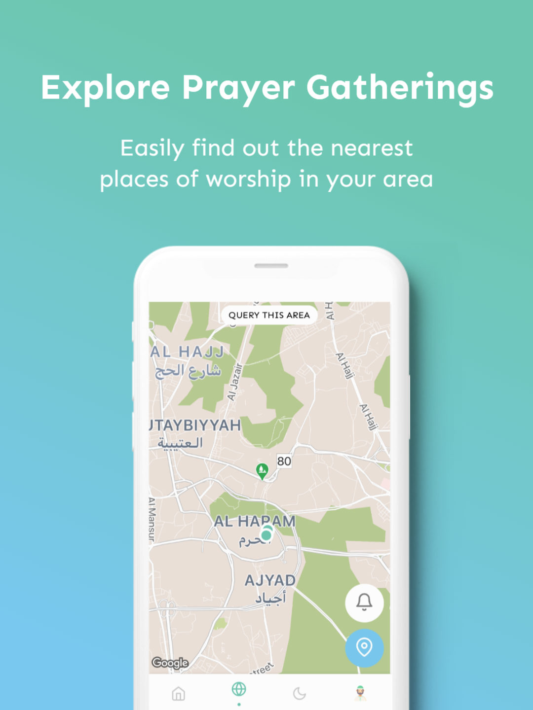
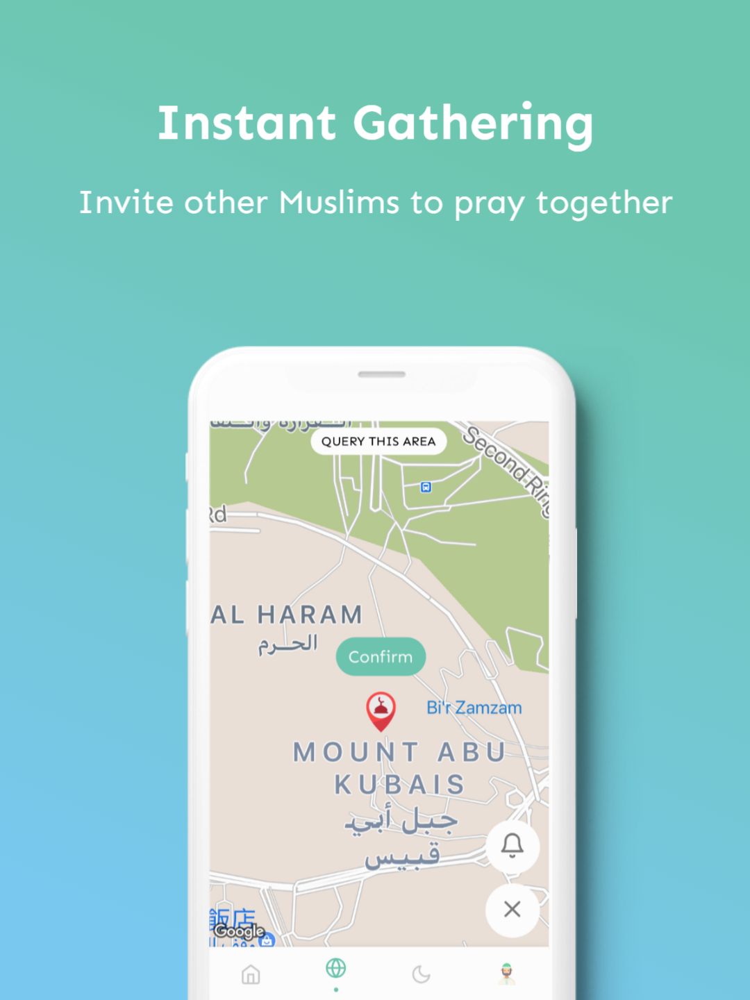
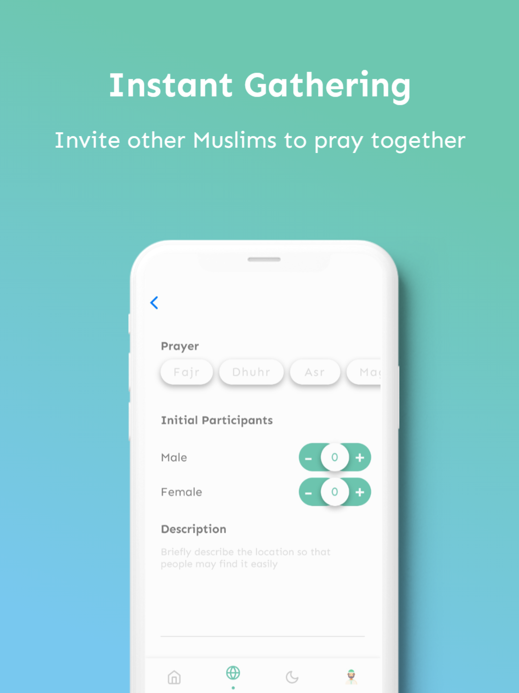

<br />
<p align="center">
  <a href="https://wahd.app">
    
  </a>

  <h1 align="center">Wahdapp</h1>

  <p align="center">
    Official source code of Wahdapp's mobile application
    <br />
    <br />
    <a href="https://discord.gg/Zn4698v8pM"></a>
    <a href="https://opensource.org/licenses/MIT"></a>
    <br />
    <br />
    <a href="">Google Play</a>
    ·
    <a href="">App Store</a>
    <br />
    <br />
  </p>
</p>

The application is written using React Native + Expo SDK and runs on both Android and iOS platforms.

## App Screenshots

|  |  |  |  |
| :------------------------------------: | :--------------------------------------: | :--------------------------------------: | :--------------------------------------: |

## Project Setup

Clone the repository from Github:

```
git clone https://github.com/wahdapp/Wahdapp.git
```

Install dependencies using yarn:

```
yarn
```

Since the application is going to read values from `.env`, you will need to create one first. `.env-sample` contains the necessary credentials to connect to a testing Firebase account. You may copy `.env-sample` and name it as `.env`:

```
cp .env-sample .env
```

To run the app on expo, simply run:

```
yarn start
```

## Contributing

See [CONTRIBUTING.md](.github/CONTRIBUTING.md).
